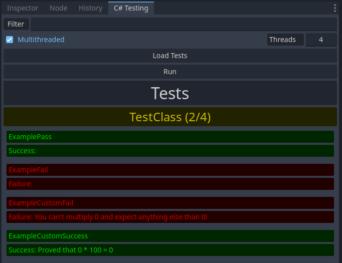

# GDMUT

A unit testing framework for C# scripts in Godot.

## Features
### Blazingly Fast 🚀
Optimized and multithreaded to allow you to run your tests at blazingly fast speeds! 🔥🚀

### Visual
A minimal and simple user-interface that displays all the unit tests and results all in a single dock.



### Filtering
Sometimes you might just want to run a certain set of tests. That's now possible with the filter option. Include a filter to match whatever tests you need to run.

### Simple To Use
Minimal overhead added to create unit tests. Declare a unit test function by adding a ```[CSTestFunction]``` onto a static, parameterless function with a ```Result``` return type. After that, you can load and run your tests effortlessly.

## How to Use
1. Press the build button before enabling the plugin. This is to allow the plugin to build the necessary files to run.
2. Ensure the plugin is enabled in the Godot editor.
3. In a script, write a test function. Test functions must be static, parameterless, be prepended with the ```[CSTestFunction]``` attribute, and return a ```Result``` type, indicating it's success or failure.
    - If an exception is thrown in your function, it will be counted as a fail.
4. Open the "C# Testing" ui on the editor (it should be on the right by default).
5. Click "Load Tests". This should populate the dock with a list of all your test functions and the types that they reside in.
6. Click on "Run Tests" to run each of the tests.

## Example Test Functions
```c#
using GdMUT;

/// <summary>
/// This is a test class for GDMUT. This is purely for demonstration. If you added
/// this into your project, feel free to delete it =)
/// </summary>
public class TestClass
{
    #if TOOLS
    [CSTestFunction]
    public static Result ExamplePass()
    {
        int x = 0;
        x *= 100;
        return (x == 0) ? Result.Success : Result.Failure;
    }

    [CSTestFunction]
    public static Result ExampleFail()
    {
        int x = 0;
        x *= 100;
        return (x != 0) ? Result.Success : Result.Failure;
    }

    [CSTestFunction]
    public static Result ExampleCustomFail()
    {
        int x = 0;
        x *= 100;
        return (x != 0)
            ? Result.Success
            : new Result(false, "You can't multiply 0 and expect anything else than 0!");
    }

    [CSTestFunction]
    public static Result ExampleCustomSuccess()
    {
        int x = 0;
        x *= 100;
        return (x == 0) ? new Result(true, "Proved that 0 * 100 = 0") : Result.Failure;
    }
    #endif
}
```
NOTE: The '``#region``' and '``#if TOOLS``' preprocessor directives are optional. Just good practice :)

## Planned Features
- ~~Multithreaded tests~~
- ~~Test filtering (filter by name which tests to run)~~
- Parameterized functions
- Async functions